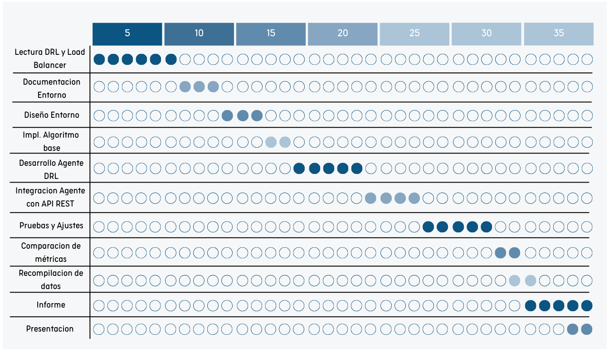

# Anteproyecto IA - 2024

# Balanceo de carga con Reinforcement Learning

## Codigo del proyecto: LBDRL (Load Balance Deep Reinforcement Learning)

## Integrantes: Martín Farrés y Agustin Olivares

## Descripcion:

El proyecto consiste en la realización de un agente de inteligencia artificial que optimice el balanceo de carga y gestione la expansión horizontal de servidores utilizando **Reinforcement Learning (RL)**. El **balanceo de carga** es el proceso de distribuir de manera equitativa el tráfico de red y las solicitudes de los usuarios entre varios servidores para garantizar un rendimiento eficiente y alta disponibilidad. La **escalabilidad horizontal** implica agregar más instancias de servidores para manejar un aumento en la carga de trabajo, mientras que la **contenedorización** permite empaquetar aplicaciones y sus dependencias en contenedores ligeros que pueden desplegarse fácilmente en diferentes entornos.

El proyecto se enfocará en el uso de **Deep Reinforcement Learning (DRL)**, dada la complejidad y cantidad de variables implicadas, como la latencia de red, el uso de CPU y RAM, la cantidad de solicitudes por segundo, y el estado de las instancias del servidor. El alcance del proyecto se limitará a evaluar la viabilidad de incorporar esta solución a un flujo de trabajo de producción y compararla con algoritmos tradicionales de balanceo de carga, tales como Round Robin, Least Connections, Weighted Round Robin y algoritmos basados en IP Hashing.

Para la realización del proyecto, se integrará el agente en un módulo dentro de una aplicación API REST que podrá interactuar con el entorno del servidor. El agente obtendrá datos relevantes, como flujo de carga en tiempo real, el número de instancias de servidor activas, porcentajes de uso de CPU y memoria, entre otros. La solución implementará herramientas de contenedorización como **Docker** y **Kubernetes**, que permitirán el despliegue y gestión de instancias de servidor. La IA recibirá permisos adecuados para la reconfiguración del Load Balancer, utilizando herramientas como **HAProxy**, **Nginx**, o integraciones con **APIs de orquestadores de contenedores**.

## Justificacion:

La utilización de Reinforcement Learning en el balanceo de carga aporta múltiples beneficios. Primero, este enfoque permite que el agente aprenda y se adapte a condiciones dinámicas, maximizando la eficiencia en la distribución de la carga y optimizando la utilización de los recursos del servidor. Una solución de DRL puede mejorar la capacidad de respuesta del sistema y disminuir el tiempo de inactividad al reaccionar automáticamente a picos de tráfico y cambios en la infraestructura.

Además es importante notar es la capacidad del agente de generalizar y aprender estrategias óptimas en entornos complejos y variables. A diferencia de las soluciones tradicionales, que siguen reglas fijas, un enfoque de RL puede ajustarse en tiempo real basándose en recompensas, proporcionando una optimización adaptativa continua.

## Listado de actividades a realizar:

1. Revisión de la literatura sobre balanceo de carga y DRL (AIMA CAP 21) [4días y 2días]
2. Lectura de documentación y selección del entorno de simulación [3 días]
3. Diseño del entorno de simulación con contenedores [3 días]
4. Implementación de un algoritmo base de balanceo de carga (Round Robin, etc.) [2 días]
5. Desarrollo del agente de Reinforcement Learning (modelo DQN, PPO) [5 días]
6. Integración del agente con el entorno de la API REST [4 días]
7. Pruebas y ajustes del agente en el entorno simulado [5 días]
8. Comparación de métricas entre el agente RL y algoritmos tradicionales [2 días]
9. Recopilación de datos de rendimiento y generación de reportes [2 días]
10. Creación del informe y análisis de resultados [5 días]
11. Elaboración de la presentación final [2 días]

## Cronograma estimado de actividades (gantt):

