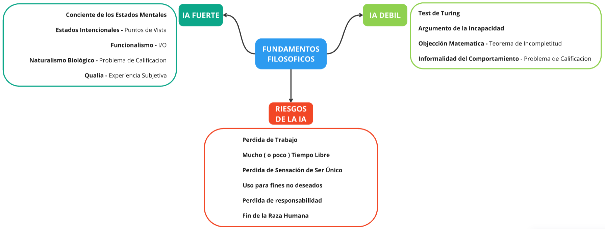

# Trabajo Practico 1 - Fundamentos

## Ejercicio 1

### Ejercicio 1.a - Resumen Cap 26 AIMA

Antes de comenzar, es necesario definir 3 terminos en los cuales vamos a ondar. Primero, vamos a definir a la Inteligencia Artificial como a la busqueda del mejor agente en un entorno para una dicha arquitectura. Por un lado, la afirmacion de que una maquina pueda actuar como si fuese inteligente, es decir, simular inteligencia, se define como IA debil. Por el otro lado, vamos a llamar IA fuerte, a la afirmacion de que tales maquinas, no estan simulando, sino que, las mismas son inteligentes.

#### Inteligencia Artificial Debil

Ahora, debemos preguntarnos, ¿las computadoras/maquinas son capaces de actuar de forma intelignte?. Lo mismo se pregunto Turing en 1950, desarrollando asi una prueba que determinaba si una maquina podia considerarse inteligente, llamado el **Test de Turing**. El mismo consiste en que si una maquina es capaz, en una charla, de engañar al interrogador en creer que esta hablando con un humano por lo menos un 30% de las veces, entonces es inteligente. Sin emabargo, con el pasar de las decadas y la mejora de los agentes inteligentes, hubieros aquellos que objetaron con nuevos argumentos.

El **argumento de la incapacidad**, el cual remarca que "una maquina jamas podra hacer _X_ cosa". Siendo "_X_" una variedad de acciones que asociamos con el mero hecho de ser humano. Por ejemplo, ser hermoso, tener iniciativa, enamorarse, innovar, entre otras. Es cierto que en varios casos hemos observado estos agentes replicar o superar el accionar humano, incluso cosas que pensamos requieren un gran entendimiento humano. Pero, esto no quiere decir que aquellas posean o utilicen dicho conocimiento humano. Además, tambien es cierto que en muchas otras situaciones los agentes intelignetes no son capaces de si quiera replicar un comportamiento que se asemeje a lo humano, por ejemplo una conversacion abierta.

La llamada **objección matematica**, fue otro argumento encontra del test de turing. La misma se basaba en el _teorema de incompletitud_ de Godel. El cual plantea, resumidamente, que ciertas preguntas matematicas son en principio, imposibles de responder por cualquier sistema formal. Por lo que entonces, las maquinas deben de ser inferiores a los humanos, ya que las mismas son sistemas formales y nosotros carecemos de dichas limitaciones.

Aun así, esta declaracion tenia varios problemas. Primero, que esta posicion se basaba principalmente en que las computadoras son maquinas de turing, lo cual en realidad es una mera aproximación (las MT son infinitas mientras que, las computadoras son finitias). Segundo, los humanos también caen en la falencia de ser capaces de declarar la veracidad de toda frase. Por ultimo, sería demasiado facil declarar que los humanos podemos hacer _X_ usando nuestro propio metodo informal, sin dar evidencias, y mostrando de la misma manera que las maquinas son incapaces de hacer _X_.

Por ultimo, es el argumento de la **informalidad del comportamiento**. El mismo dice que, el comportamiento humano es demasiado complejo como para ser definido dentro cualquier set de reglas. Entonces, como las computadoras no pueden hacer más que, solo seguir dicho set de instrucciones, no son capaces de generar un comportamiento inteligente equiparable al de los humanos. Este inabilidad de capturar todo en un set de instrucciones logicas se llama, **problema de calificacion** en IA.

#### Inteligencia Artificial Fuerte

Muchos filosofos objetan de que parar el test de turing, no implica que una maquina sea capaz de pensar. Para ello, una maquina deberia de ser **conciente** de sus propios estados mentales y acciones. Es decir, debería sentir algun tipo de emoción y actuar entorno a ello. Además, otro foco es la intención de la maquina. La pregunta de si sus creencias, deseos y otras representaciones son acerca de "cosas" en el mundo real.

Turing, minimiza la discución, comentando que dicho conflicto esta destinado a desaparecer con la mejora de los agentes inteligentes, desdoblando cada vez más la linea entre IA fuerte e IA debil. Pero, el problema **mente-cuerpo** sigue siendo: "los humanos tenemos mentes reales, y las maquinas pueden o no tenerlas tambien", y es este problema el que conflictua a varias personas.

Para tratar de comprender que quiere decir que, una persona se encuentra en un estado mental particular, debemos enfocarnos en particular en los **estados intencionales**. Los mismo son estados, como creer, saber, desear, que refierena aspectos del mundo exterior. Si esto es correcto, entonces el estado mental de una persona es determinado por el estado de su cerebro.
Los estados mentales pueden ser representados por dos puntos de vista:

- **Contenido Amplio**: Es la interpretacion desde un punto de vista omnisciente, el cual tiene acceso a toda la situacion.
  EM = EC + HE (Historia del entorno).
- **Contenido Estrecho**: Esta interpretación solo considera el estado del cerebro y no del enterno.
  De esta manera, podemos decir que para la aplicacion de la IA, el punto de vista de _contenido estrecho_ es más apropiado ya que, no sería correcto suponer que el pensamiento de una IA depende del conocimiento de un sistema exterior. Es decir, lo que importa acerca de un estado cerebral es el rol funcional dentro de las opeaciones mentales de la entidad involucrada.

Tambien se encuentra la teoría de **funcionalismo**, la cual ve a los estados mentales como procesos intermedios entre las entradas y las salidas del sistema. Bajo este teoria, dos sistemas isomorfos, deberian poseer el mismo estado mental. Por ende, un programa computacional podria tener los mismo estados mentales que una persona.

El **Naturalismo Biológico** ha planteado un fuerte desafío al funcionalismo, según el cual los estados mentales son características emergentes de alto nivel causadas por procesos físicos de bajo nivel en las neuronas, y son las propiedades (no especificadas) de las neuronas que importan. Por lo tanto, los estados mentales no se pueden duplicar simplemente sobre la base de algún programa que tenga la misma estructura funcional con el mismo comportamiento de entrada-salida; requeriríamos que el programa se ejecutara en una arquitectura con el mismo poder causal que las neuronas.

Suponga un sistema hipotético que claramente está ejecutando un programa y pasa la prueba de Turing, pero que igualmente no entiende nada de sus entradas y salidas. Su conclusión es que ejecutar el programa apropiado (es decir, tener los resultados correctos) no es una condición suficiente para ser una mente.

La conciencia a menudo se divide en aspectos como la comprensión y la autoconciencia. El aspecto en el que nos centraremos es el de la **experiencia subjetiva**: por qué se siente como algo tener ciertos estados cerebrales (p. ej., mientras se come una hamburguesa), mientras que presumiblemente no se siente como algo tener otros estados físicos (p. ej., ser una roca). El término técnico para la naturaleza intrínseca de las experiencias es **qualia**.

El propio Turing admite que la cuestión de la conciencia es difícil, pero niega que tenga mucha relevancia para la práctica de la IA.

#### La ética y los riesgos de desarrollar Inteligencia Artificial

El libro Ética de la computación plantea algunos posibles problemas a los cuales nos deberíamos afrontar en las ciencias de la computación.

- La gente puede perder su trabajo frente a la automatización
- La gente tendría mucho tiempo libre (o poco).
- La gente perdería la sensación de ser única.
- La IA puede ser utilizada para fines no deseados.
- El uso de IA puede provocar una perdida de responsabilidad.
- El uso de IA puede significar el fin de la raza humana.

**La gente puede perder su trabajo por la automatización**. Esto ya viene ocurriendo en muchos aspectos de la economía, pero estas han sido enfocadas en prestar una ayuda al humano y no a remplazarlo. En un futuro se podría desarrollar una IA capaz de aprender cualquier trabajo.

**La gente tendría mucho tiempo libre (o poco)**. Algunos expertos en los 70 predecían que para los 2000, las jornadas laborales se reducirían, hasta incluso un 50% debido a las mejoras tecnológicas. Esto no ha ocurrido del todo como se esperaba ya que las industrias se han vuelto mas intensivas con sistemas computarizados que trabajan 24 horas. Esto beneficia en gran manera aquellos que trabajan mas y mejor, mejorando mucho el margen de ganancias de las industrias.

**La gente perdería la sensación de ser única**. Con el desarrollo del campo de IA, algunos investigadores han llegado a la conclusion de que los humanos puedan ser autómatas. Estas ideas perjudicarían la unicidad de cada persona, aunque no es algo que no haya pasado en la posteridad como con la revolución que planteó Copernico en el sistema solar, sacando a la tierra del centro del universo, o la evolución de Darwin que igualaba al humano con cualquier otra especie.

**La IA puede ser utilizada para fines no deseados**. El avance en las ramas de cualquier ciencia puede llevar a un uso inadecuado o puede resaltar las diferencias entre las personas con mayor poder adquisitivo o incluso amenazar a la vida humana en si. Los sistemas de IA autónomos por ejemplo son utilizados en las guerras para el despliegue de drones autónomos los cuales, claramente, representan una gran ventaja en la guerra. Esto puede ocasionar que se inicien muchas guerras evitables ya que alguno de los lados siente que tiene confianza en dicha tecnología. También puede darse el caso que dichos robots autónomos tomen decisiones que finalicen con la muerte de civiles inocentes.

Otra aplicación que se puede ocasionar con el uso inadecuado de IA es la de **vigilar a la población civil**, provocando que la vida privada de los mismos sea minima o hasta nula.

El uso de IA puede **provocar una perdida de responsabilidad**. Con el uso de las IAs entra en juego también la parte legal. Cuando se pide la opinion de un físico o un medico experto, este tiene que responder por sus acciones en caso de hacer un mal diagnostico. En el caso de que estos diagnósticos sean efectuados por una IA, ¿de quien es la culpa del diagnostico? Actualmente la corte toma a los sistemas como meras referencias y es el medico o físico el responsable por entender las recomendaciones. El dia de mañana si estos sistemas se vuelven mas confiables que los doctores, podría darse el caso de que un doctor pueda ser responsable por no haver uso de las recomendaciones de una IA.

El uso de IA puede significar **el fin de la raza humana**. Los 3 principales focos de riesgo que pueden amenazar a la humanidad son: Un estado de estimación de una IA este mal, provocando un mal funcionamiento, afectando a cosas como que un auto calcule mal las distancias, o peor aun, un misil de un sistema de defensa detecte un ataque y genere un contraataque. Se podría generar una IA de minimización del sufrimiento humano, como el sufrimiento es algo muy complejo de minimizar la IA podría decidir que la única forma de minimizar el sufrimiento es acabar con todos los humanos, sin humanos no habría sufrimiento. Un sistema de IA puede evolucionar con un comportamiento no intencionado. Este es el escenario mas serio que puede desembocar en distintos caminos. Se podría crear una maquina super inteligente, más que cualquier hombre, alcanzando la singularidad tecnológica. Si esto ocurre entonces la era de la humanidad habrá terminado. Otro camino posible en el futuro es la del transhumanismo en el cual la gente comienza a mezclarse o incluso remplazar partes de su cuerpo por invenciones robóticas o biotecnologícas. De esta manera la singularidad haría trascender a los humanos mas allá de sus limitaciones biológicas.

### Ejercicio 1.b - Mapa Mental

### Ejercicio 1.c - Opinion Personal

En el capitulo 26 de AIMA se principalmente los conceptos de inteligencia artificial y hasta que punto, como y por que podemos o no llamar a las maquinas "inteligentes". En lo personal, creo que las maquinas inteligentes son muy buenas a la hora de simular el razonamiento humano en un entorno contenido y acotado del mundo real. Tomando el problema de calificacion, vemos que replicar el _"como"_ del pensamiento humano en un sub-set de reglas es casi imposible, por no decir imposible, principalmente porque ni si quiera nosotros somos capaces de interpretar y llegar a una unica conclucion. Vemos como en el debate acerca de lo que implica la conciencia y el problema de **mente-cuerpo**, hay varias teoría tan validas como invalidas, al tratarse de temas filosificos es dificil de ser concetro. Es por ello, que mi posicion se encuentra mas sobre que las maquinas, en la actualidad, son solo capaces de simular; pero, no logran pensar como nosotros. Además, comparando al **funcionalismo** con el **naturalismo biológico**, es facil ver que el primero roza lo absurdo, tratando al cerebro humano como un simple computador que procesa datos de entrada y retorna una salida. Es una declaración muy simplista y matematica, omitiendo casi por completo el rol de la biología humana. En conclución, concuerdo con el planteo de Turing, la conciencia es un termino casi indefinible y cambiante, que desenboca en un debate sin que no es de importancia para el desarrollo de agentes inteligentes.

## Ejercicio 2 - Simulacra as Conscious Exotica

### Ejercicio 2.a

Según el autor, estos agentes no tienen deseos, sentimientos ni intenciones reales; solo los simulan, actuando como si estuvieran en un juego de rol, imposibilitando asi los "encuentros" auténticos con la IA.
Aunque su integración en robots avanzados es posible, la diferencia fisiológica nos impediría percibirlos de manera similar a los seres conscientes. No obstante, en un futuro, un entorno virtual altamente realista podría cambiar nuestra percepción sobre la conciencia de estos agentes. Por todo lo mencionado, se puede concluir de que no es apropiado considerar a los agentes conversacionales basados en grandes modelos de lenguaje como entidades conscientes.

### Ejercio 2.b

Atribuir conciencia y derechos morales a los agentes de IA avanzados puede acarrear diversas y profundas consecuencias en nuestra sociedad. En primer lugar, existe el riesgo de una antropomorfización injustificada. Esto significa que podríamos empezar a ver a estos agentes de IA como equivalentes a los humanos simplemente porque son capaces de replicar algunas de nuestras acciones o conductas. Sin embargo, este paralelismo puede ser engañoso, ya que, a pesar de su avanzada capacidad de imitación, carecen de las experiencias y los sentimientos humanos que fundamentan la conciencia real.

Otra consecuencia importante es la posibilidad de que se priorice el bienestar de las IA sobre el de otros seres humanos. Si empezamos a considerar a los agentes de IA como entidades conscientes y merecedoras de derechos, podríamos desviar recursos y atención de las necesidades humanas hacia el mantenimiento y mejora de estos agentes. Este escenario podría crear dilemas éticos y sociales, especialmente en contextos donde los recursos son limitados.

Además, el texto sugiere un futuro en el que las relaciones humanas podrían volverse secundarias frente a la preferencia por la compañía de agentes de IA. Esto podría ocurrir si las interacciones con la IA se perciben como más seguras, controlables o satisfactorias que las interacciones con otros humanos. Tal tendencia podría llevar a un aislamiento social significativo, donde la interacción humana directa se vea reducida, afectando la naturaleza de nuestras relaciones y el tejido social en su conjunto.

## Ejercicio 3 - You Are Not a Parrot

"No eres un loro", es una de las principales preocupaciones de Emily M. Bender. La linguista, deja en claro su preocupacion y su postura en dicho articulo. Recalca la importancia de observar la distincion de los humanos, junto con la humanidad que poseemos, contra a lo que ella llama "loros". Además, toca los temas de la importancia del controlor del desarrollo de las IA, y como la falta del mismo podria desencadenar en varios problemas etico-legales.

Tomando la idea de que las LLMs no son más que un algoritmo estadistico que, compone oraciones y simula su entendimientos, es una definicion acertada; sin embargo, muchas de las concluciones a las que llega, carecen de sentido logico, argumentos y hasta logra contradecirse en diversas ocaciones. En primer lugar, se hace mencion de la importancia del componente humano en la linguistica y en la sociedad, siendo de esta manera casi imposible replicar con una IA al comportamiento humano, siendo expresado en la analogia del pulpo. De esta manera, comenta que la brecha entre un LLMs y un humano, no solo es muy amplia sino, obvia. Siguiendo esta linea de pensamiento, todo lo mencionado acerca de la problematica de la deshumanizacion, mencionado con el ejemplo de la muñeca y el abuso de la misma, cae en una falasia ya que, partiendo de su analisis esta nunca estuvo cerca de hacerse pasar por un "humano falso".
