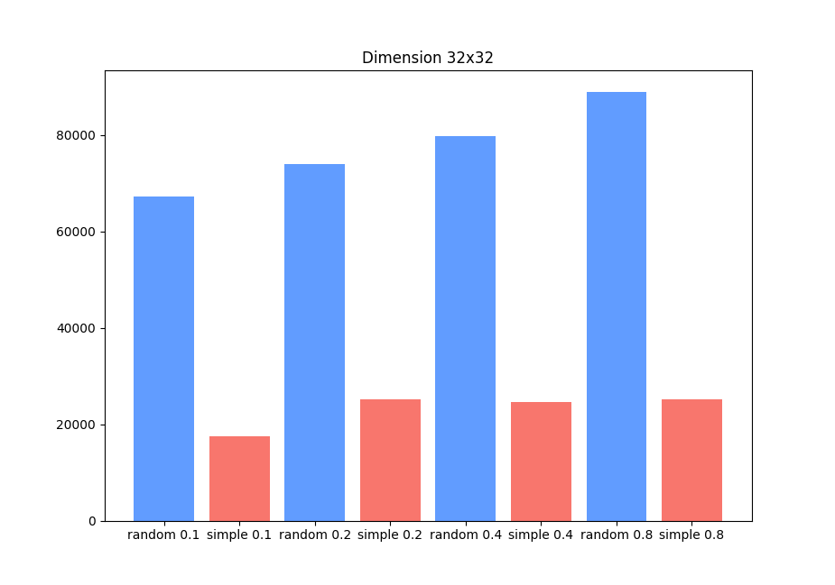

# Introduccion

El objetivo del proyecto es realizar dos agentes inteligentes basicos y medir sus rendimientos, realizando una comparacion entre sí. Los agentes formaran parte de la simulacion del entorno de la aspiradora.

# Marco Teorico y Problema

Se realizaran dos agentes inteligentes, un agente inteligente basado en la seleccion aleatoria de toma de desciciones y un agente inteligente de reflexion simple. Ambos se evaluaran dentro de un entorno de forma de grilla de varios tamaños;

- Entornos de: 2x2, 4×4, 8×8, 16×16, 32×32, 64×64, 128×128.
  Además el entorno tambien posee otra variable, el porcentaje de suciedad. Siendo a un mayor porcentaje de suciedad, más celdas sucias, y a menor porcentaje de suciedad, menor cantidad de celdas con suciedad. Se evaluaran los agentes en los siguentes porcentajes de suciedad:
- Porcentaje de suciedad en el ambiente: 0.1, 0.2, 0.4, 0.8.

# Diseño Experimental

En esta evaluacion se tomaron ambos agentes en todos los posibles entornos con todos los posibles porcentajes de suciedad. Para cada combinacion posible (Tamaño x PorcentajeSuciedad), se realizaron 10 iteraciones por agentes, sacando así un promedio de la cantidad de movimientos necesarios para limpiar por completo al ambiente.

Las celdas de suciedad se generaron de manera aleatoria, siguiendo las variables de probabilidad de suciedad. También, la posicion inicial de los agentes se determina de manera aleatoria. De esta manera, evaluaremos los agentes en igualdad de condiciones; sin embargo, esto puede ocacionar pequeñas variaciones a la hora de replicar el experimento.

# Analisis de los resultados

Para obtener los siguientes resultados se le permitio a los agentes realizar movimientos hasta que se haya limpiado el entorno en su totalidad. Los graficos fueron generados utilizados **matplotlib** con el codigo presente en **_graphs.py_**.

## Graficos

## Analisis

A primera vista, hay una clara distincion de performance entre ambos agentes. Siendo el agente reflexivo simple, más del doble de rápido que el agente aleatorio en todos los posibles entornos.

Además, podemos observar que a medida que aumenta el porcentaje de suciedad en los entornos más pequeños, vemos un crecimiento en la cantidad de iteraciones. Sin embargo, a medida que el entornto crece en tamaño, la cantidad de iteraciones necesarias no presenta una variacion notable.

# Conclusión

En función de los resultados obtenidos, es evidente que el agente reflexivo simple es mejor en términos de rendimiento e iteraciones que el agente aleatorio. Esto se debe a que el agente aleatorio simplemente selecciona acciones de forma puramente aleatoria, sin preguntarse si la casilla sobre la que está posicionado está sucia o no, mientras que el reflexivo simple si lo hace.
