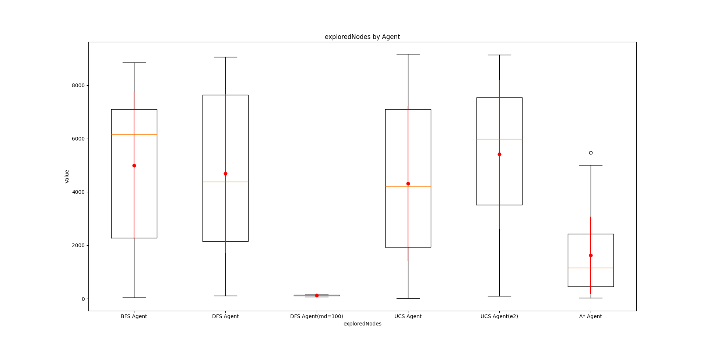
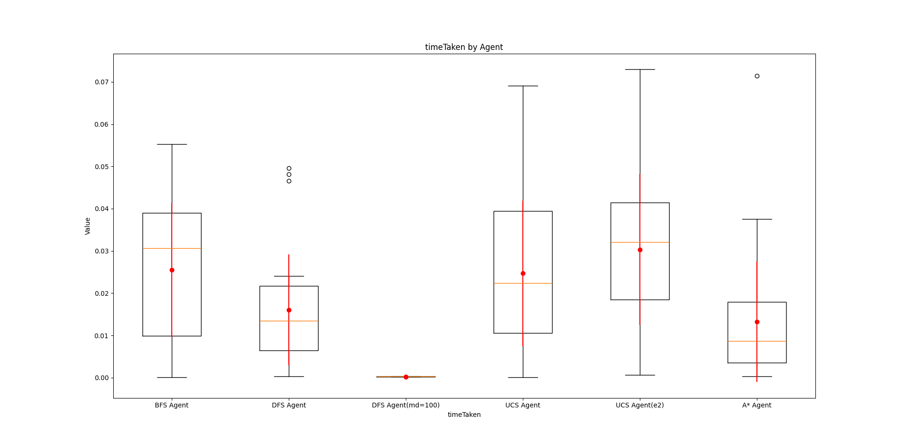

# Reporte: Busquedas Informadas y No informadas

## Introducción

Se implementaron y analizaron diferentes algoritmos de búsqueda no informada y uno de búsqueda informada para resolver problemas en un entorno de tipo FrozenLake. Los algoritmos evaluados fueron los siguientes:

- Búsqueda en anchura (BFS)
- Búsqueda en profundidad (DFS)
- Búsqueda en profundidad limitada (DLS)
- Búsqueda de costo uniforme (UCS)
- Búsqueda A\* (informada)

Cada algoritmo fue probado bajo dos escenarios de costos para las acciones:

1. Costo constante de 1 por cada acción.
2. Evaluación del costo solo en el algoritmo UCS, donde el costo de una acción es su identificador + 1.

## Marco Teórico

El entorno utilizado fue el **FrozenLake-v1** de la librería Gymnasium en Python. Este entorno es una cuadrícula de tamaño `n x n` que representa un lago congelado con agujeros, los cuales actúan como obstáculos para el agente. En una posición aleatoria, se coloca un agente y su objetivo.

El agente puede moverse en cuatro direcciones (izquierda, abajo, derecha, y arriba), y las acciones se representan por los números 0 a 3. Se desactivó la propiedad `"is_slippery"` del entorno para garantizar que el agente no se deslice, permitiendo así un control preciso de las acciones. El objetivo del agente es alcanzar el objetivo evitando los obstáculos en el lago.

Para cada algoritmo, se evaluaron dos escenarios diferentes. En el primero, el costo de las acciones es siempre 1, mientras que en el segundo, evaluado únicamente en el algoritmo UCS, el costo es el valor del identificador de la acción + 1.

## Diseño Experimental

Se realizaron experimentos ejecutando cada algoritmo en 30 entornos generados aleatoriamente utilizando la semilla "TP3" de la biblioteca random de Python. Los algoritmos fueron desarrollados en Python 3.0.

Los algoritmos analizados fueron:

- **BFS**: Expande los nodos desde el punto inicial, explorando primero los nodos frontera.
- **DFS**: Explora los nodos en profundidad priorizando siempre el nodo de la izquierda.
- **DLS**: Similar a DFS, pero con una profundidad limitada a un valor específico (en este caso, 10).
- **UCS**: Prioriza los nodos con menor costo. Se evaluaron dos escenarios de costos: uno con costo constante de 1 y otro con costos variables.
- **A\***: Similar a UCS, pero incorpora una heurística basada en la distancia Manhattan para estimar el costo de los nodos en ambos escenarios.

## Análisis de Resultados

Para todas las ejecuciones de todos los algoritmos en los 30 entornos se recopilaron las medias, medianas y desviaciones estándar, con los cuales se realizaron diagramas de cajas y extensiones. Además, se realizó un gráfico adicional que muestra la cantidad de veces que un algoritmo encontró una solución en los entornos en los que se ejecutó. Recalcar que se tuvieron encuenta solo los casos menores a 1000 acciones.

### Diagrama de cajas y extensiones: Costos con Escenario 1

Con estos resultados podemos observar que los algoritmos, BFS, UCS Y A\* encuentran caminos que no superan aproximadamente los 180 de costo. Mientras que, el DFS si es que encuentra una solucion el promedio es casi 6 veces mayor que el resto.

### Diagrama de cajas y extensiones: Costos con Escenario 2

En este diagram, observamos nuevamente el mismo desempeño de los algoritmos. Lo unico que vemos es un aumento de los costos a lo largo de todas las busquedas.

### Diagrama de cajas y extensiones: Nodos Explorados

En este caso, vemos que tanto el BFS, el DFS y el UCS, explorando en promedio 4000-5000 estados, es decir, casi la mitad del mapa. Mientras que, el A\* posee una mejora notable. Siendo el promedio un valor aproximado de 3000 estados, pero más importante aún, es la baja dispersion del algoritmo.

### Diagrama de cajas y extensiones: Tiempo Total

Mencionar que los resultados de tiempo son especificos a la velocidad de procesamiento local, podemos obtener una visión de la eficiencia de cada algoritmo. Vemos que el DFS, es el más veloz, seguido por el BFS, muy cercano con A\* y por último vemos al UCS. Sin embargo, notar que las diferencias son de milisegundos.

### Grafico de barras: Cantidad de veces que el algoritmo encontró una solución en menos de 1000 acciones.

Por último, vemos la razón de los valores nulos del DFS limitado a una profundidad de 10 ya que, nunca obtiene resultados en un mapa tan grande. Además, vemos que el DFS a pesar de los valores obtenido, solo obtiene resultados en un 1/5 de las veces. El resto tiene un 100% de completitud.

## Conclusion

De todos los gráficos obtenidos podemos concluir que existe una superioridad de 3 algoritmos: El BFS, el UCS y el A*. Sin embargo, el BFS y el A* son más rápidos que el UCS y a su vez el A\* explora menos estados que los otros dos.

Personalmente, opino que la diferencia en tiempo de ejecución es mínima (aproximadamente unos 0.02 segundos), por lo que creo que el mejor algoritmo es el A\* por la gran diferencia que existe en la cantidad de estados explorados. Sin embargo, el BFS también podría ser una buena opción a considerar.
