# Trabajo Practico 5

## Introduccion

Los algoritmos empleados para abordar el problema de las N-reinas en este trabajo practico fueron:

- **Hill Climbing**
- **Simulated Annealing**
- **Algoritmo Genetico**

Para este problema se tomaron tableros de tamaños 4, 8, 10, 12, 15 y se compararon los resultados de cada algoritmo

## Marco Teorico

Para representar el tablero de ajedrez, se optó por una estructura de datos sencilla: una lista. Cada elemento de esta lista indica la fila en la que se encuentra la reina de la columna correspondiente.

A partir de esta representación, se implementaron tres algoritmos de búsqueda: Hill Climbing, Simulated Annealing y un algoritmo genético.

*Hill Climbing*: Este algoritmo comienza con una configuración aleatoria del tablero y busca mejorarla de forma gradual. En cada iteración, se generan nuevas configuraciones explorando movimientos locales de las reinas. Se selecciona la nueva configuración que minimice el número de ataques entre reinas.

*Simulated Annealing*: Similar a Hill Climbing, pero permite aceptar movimientos que empeoran la solución con una cierta probabilidad. Esto ayuda a evitar quedar atrapado en óptimos locales.

*Algoritmo Genético*: Este algoritmo inspira su funcionamiento en la evolución biológica. Se crea una población inicial de tableros aleatorios. Luego, se seleccionan los mejores tableros (individuos) para reproducirse y generar una nueva generación. Se aplica un operador de cruce para combinPara el desarrollo de los algoritmos, se utilizó una representación del tablero mediante una lista, donde cada elemento corresponde a la posición de una reina en su respectiva columna.

Al inicio de cada algoritmo, se generó aleatoriamente un tablero, el cual se utilizó como punto de partida en el caso de los algoritmos Hill Climbing y Simulated Annealing.

En el caso del primer algoritmo, Hill Climbing, se parte de una solución generada aleatoriamente y se generan soluciones vecinas al mover una reina dentro de su columna. A continuación, el algoritmo examina estas soluciones vecinas y selecciona aquella que presenta la mejor función objetivo, que en este contexto corresponde al número mínimo de pares de reinas que se amenazan mutuamente.

El segundo algoritmo, Simulated Annealing, es similar al Hill Climbing, pero introduce la posibilidad de aceptar soluciones peores que la actual con una cierta probabilidad, lo que permite explorar el espacio de soluciones de manera más amplia.

Con respecto al algoritmo genético, se generó una cantidad determinada de tableros, que constituyeron la población inicial. A partir de esta población, se seleccionaron los mejores individuos mediante un método de torneo. Posteriormente, se llevó a cabo la reproducción de estos padres a través de un proceso de cruza, que incluye una probabilidad de mutación para introducir variaciones en la nueva generación.
ar características de los padres y un operador de mutación para introducir variabilidad en la población.

## Diseño Experimental

A continuacion se detallara un poco mas sobre la implementacion de cada algoritmo y los puntos a tomar en cuenta para cada uno

#### Información sobre el Algoritmo Hill Climbing

- **Generación de Vecinos**: El algoritmo genera vecinos para una tabla de reinas al cambiar la posición de una reina en cada columna. Para cada columna, se crean nuevos estados (tablas) al mover la reina a todas las filas posibles, excepto a su posición actual.

- **Evaluación de Vecinos**: Se evalua cada vecino generado y se calcula el número de conflictos para cada uno. Esto se hace mediante la función `checkConflicts`, que cuenta los pares de reinas en conflicto.

- **Selección del Mejor Vecino**: El algoritmo identifica el vecino con el menor número de conflictos. Si hay varios vecinos que comparten el mismo número mínimo de conflictos, uno de ellos se selecciona aleatoriamente como el mejor vecino.

#### Información sobre el Algoritmo Simulated Annealing

- **Tabla Inicial**: El algoritmo comienza con una tabla inicial que representa la disposición de las reinas.

- **Temperatura Inicial**: La temperatura inicial se establece en 1000, lo que permite explorar una amplia gama de soluciones al principio del proceso.

- **Máximo de Iteraciones**: Se permite un máximo de 1000 iteraciones para la búsqueda de soluciones, proporcionando un límite al tiempo de ejecución del algoritmo.

- **Selección de Vecinos**: En cada iteración, se generan todos los vecinos posibles de la tabla actual. Se selecciona uno aleatoriamente para considerar como el próximo estado.

- **Tasa de Enfriamiento**: Se utiliza una tasa de enfriamiento del 90% (0.90), lo que significa que la temperatura se reduce en un 10% después de cada iteración. Afectando la probabilidad de aceptar movimientos que incrementan los conflictos.

- **Criterio de Aceptación**: El algoritmo acepta el siguiente estado bajo dos condiciones:
  - Si el estado vecino tiene menos conflictos que el estado actual, se acepta.
  - Si el estado vecino tiene más conflictos, se acepta con una probabilidad determinada por la función de Boltzmann, que depende de la diferencia de conflictos y de la temperatura actual.

- **Historial de Conflictos**: Se mantiene un registro del número de conflictos de reinas a lo largo de las iteraciones para evaluar el progreso del algoritmo hacia una solución óptima.

#### Información sobre el Algoritmo Genético

- **Población Inicial**: Dependiendo del tamaño del tablero (n), se establece un número variable de individuos en la población inicial:
  - Para \( n = 4 \): 20 individuos
  - Para \( n = 8 \): 100 individuos
  - Para \( n = 10 \): 150 individuos
  - Para \( n = 12 \): 200 individuos
  - Para \( n = 15 \): 250 individuos

- **Método de Selección por Torneo**: Se seleccionan padres utilizando un torneo con una cantidad de participantes definida por la partición, la cual se determina en función del tamaño del tablero.

- **Cruzamiento**: Se implementa un cruzamiento de un punto entre los padres seleccionados para generar nuevos hijos. La elección del punto de cruzamiento se realiza de manera aleatoria, asegurando que al menos un elemento de cada padre esté presente en los hijos.

- **Mutación**: La probabilidad de mutación está fijada en un 5% (0.05). Durante la mutación, se selecciona aleatoriamente una columna y se cambia la fila de la reina en esa columna.

- **Generaciones**: El algoritmo tiene un límite de 1000 generaciones para encontrar una solución óptima. En cada generación, se evalúa el fitness de los hijos generados, que se calcula como el número total de pares de reinas que no se atacan. Si se alcanza el máximo fitness posible, se considera que se ha encontrado una solución.

### Criterios de Finalización y Resultados

- **Condición de Parada**: Los algoritmos se detienen si se encuentra un estado sin conflictos (es decir, un estado óptimo donde ninguna reina ataca a otra) o si se alcanza el máximo de iteraciones/generaciones permitidas.

- **Resultados**: El algoritmo devuelve la mejor tabla encontrada, el número de conflictos en esa tabla, el número de movimientos realizados y el historial de conflictos a lo largo de la ejecución.

## Analisis de Resultados

Para evaluar el desempeño de los algoritmos, se construyeron diagramas de caja que representan la distribución de los tiempos de ejecución obtenidos en 30 iteraciones para cada tamaño de tablero.

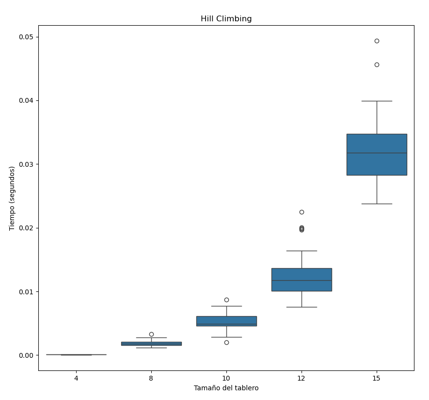
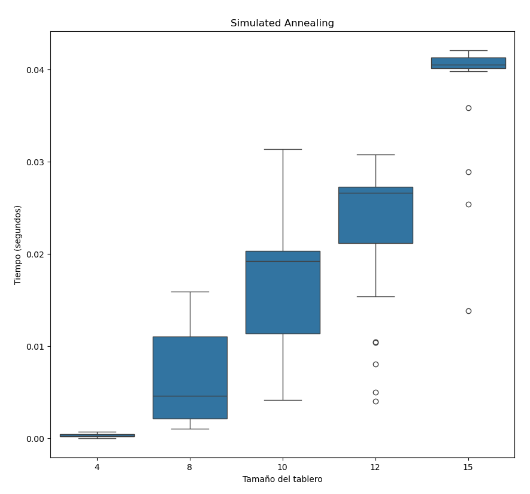
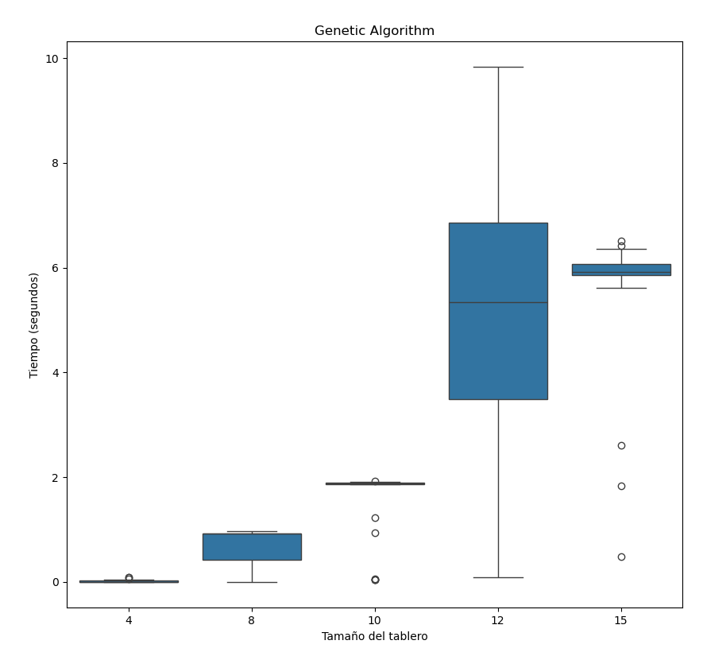

En términos de eficiencia temporal, el algoritmo Hill Climbing demostró ser ligeramente más rápido que Simulated Annealing, especialmente para tableros de menor dimensión. Sin embargo, el algoritmo genético presentó el peor desempeño temporal en todos los casos analizados.

## Cantidad de Estados 

Se construyeron diagramas de caja para visualizar la distribución del número de estados explorados por cada algoritmo a lo largo de todas las instancias del problema, considerando un límite máximo de iteraciones.

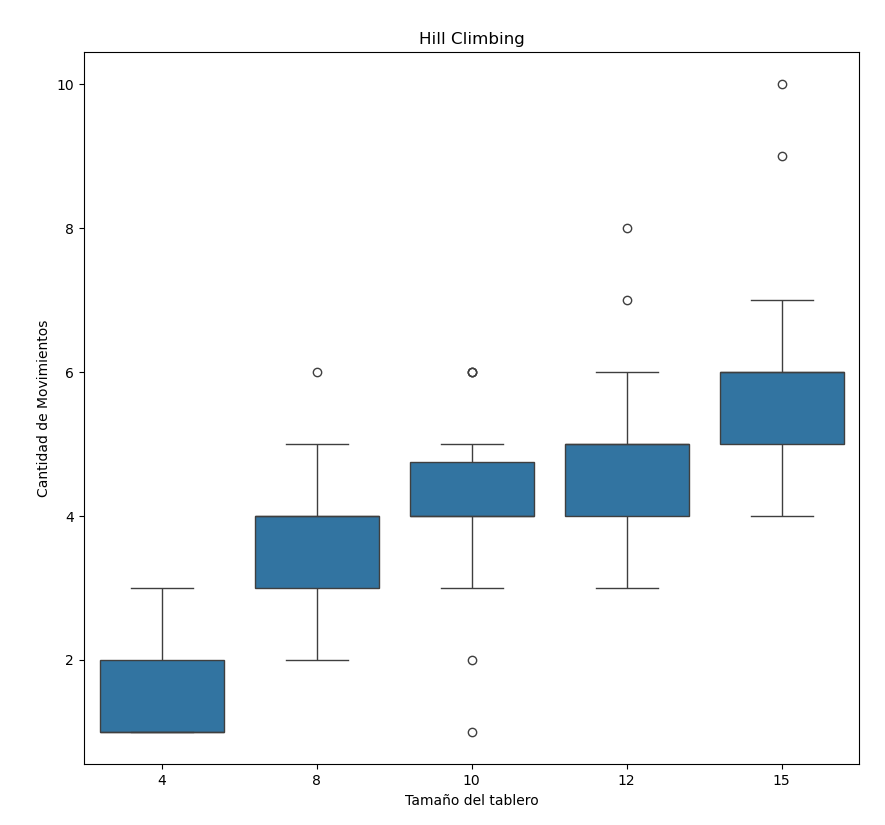
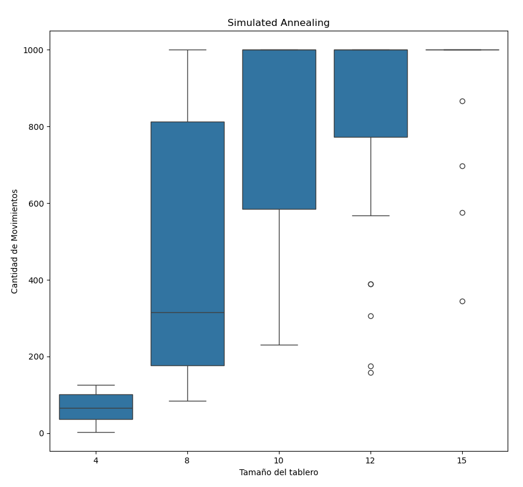
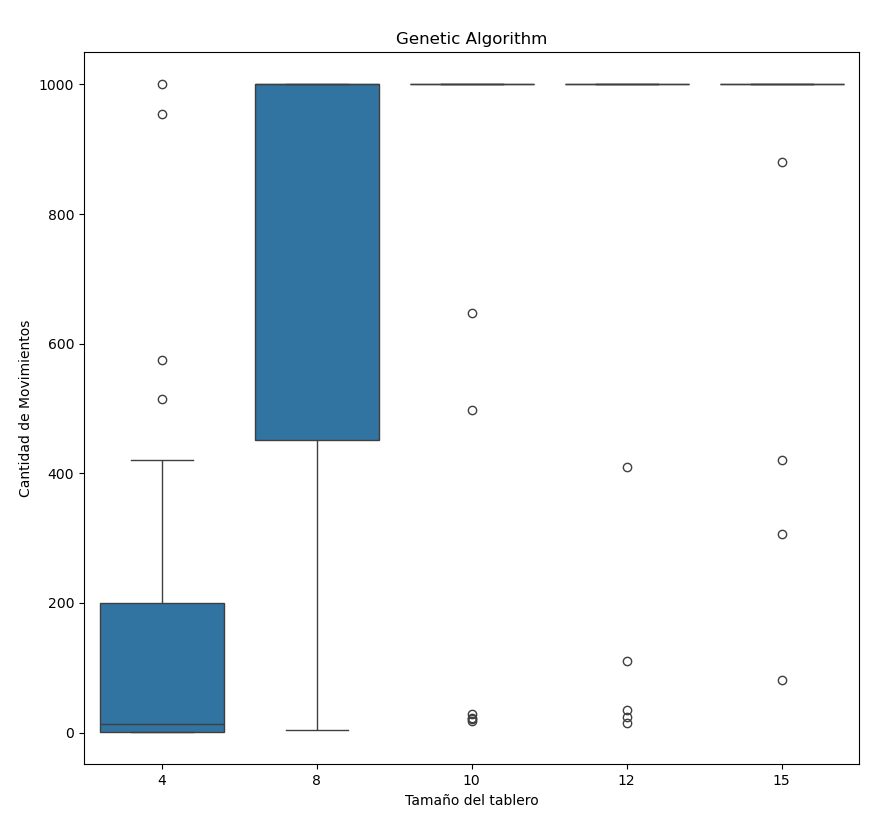

Los resultados obtenidos muestran que el algoritmo Hill Climbing explora un espacio de búsqueda significativamente menor en comparación con Simulated Annealing, independientemente del tamaño del problema. Esta diferencia se atribuye a la capacidad de Simulated Annealing de escapar de óptimos locales mediante la aceptación de soluciones de menor calidad con una cierta probabilidad. Por su parte, el algoritmo genético, debido a su naturaleza poblacional y a la aplicación de operadores genéticos, explora un espacio de búsqueda mucho más amplio.

## Evolucion Reinas Amenazadas

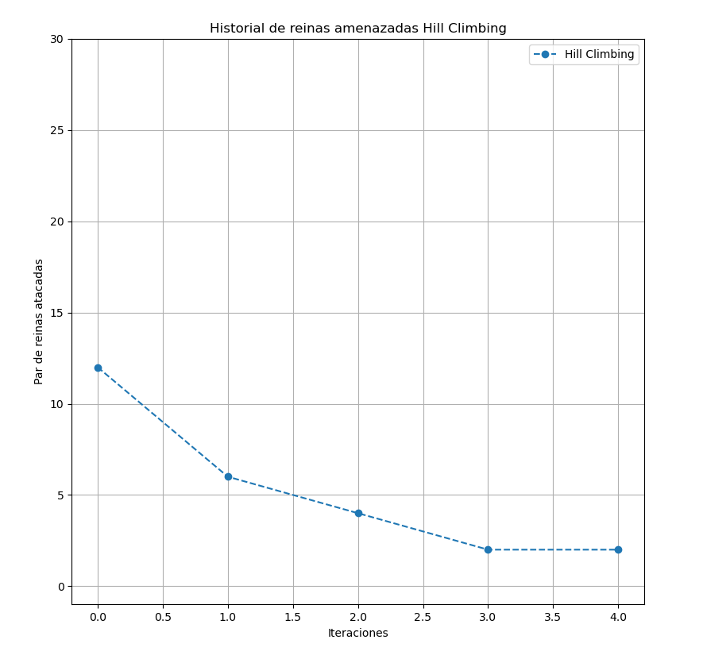
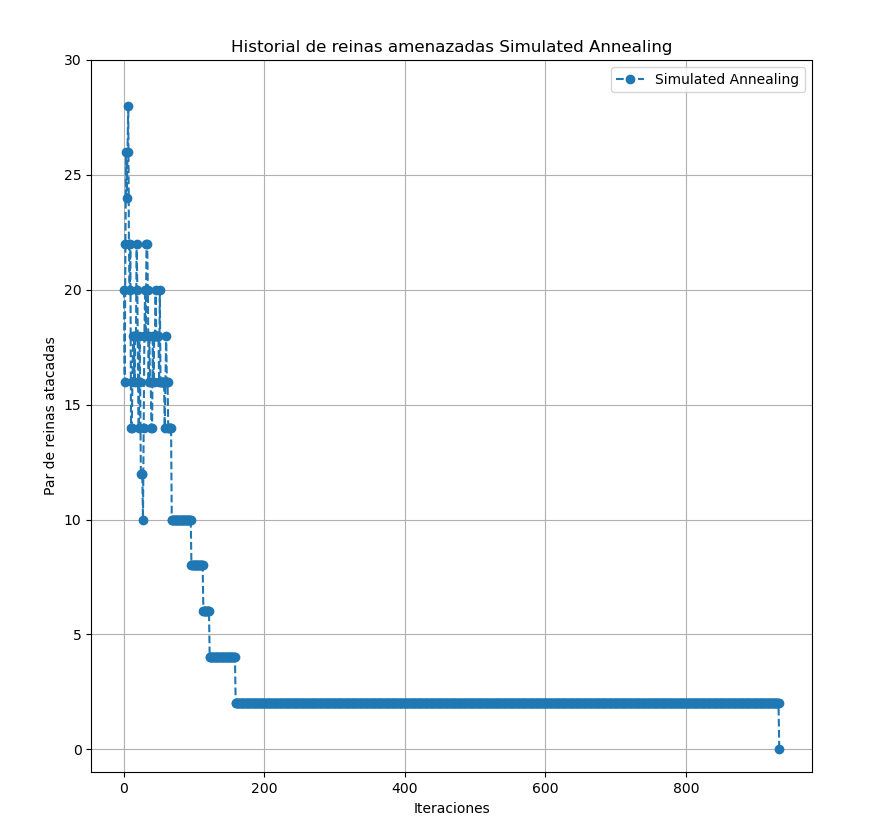
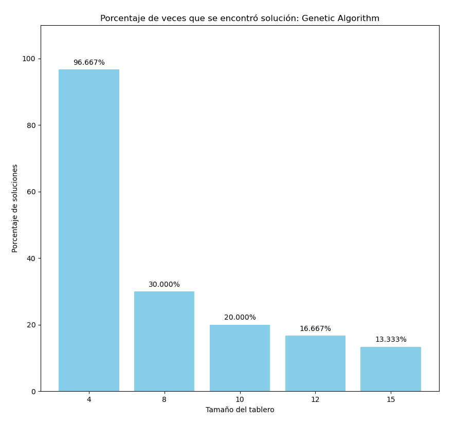

El algoritmo Hill Climbing exhibe una tendencia decreciente en el número de conflictos, sin embargo, tiene la desventaja de poder quedar estancado en un óptimo local. Simulated Annealing, por su parte, presenta una exploración inicial más amplia debido a la probabilidad de aceptar movimientos hacia estados de mayor costo, lo que le permite escapar de óptimos locales y alcanzar la solución óptima. El algoritmo genético, aunque mantiene una población diversa, no logró encontrar la solución en el límite de iteraciones establecido, lo que sugiere la necesidad de ajustar los parámetros del algoritmo o incrementar el número de generaciones.

## Soluciones Encontradas

Finalmente se analiza el porcentaje de exito de cada uno de los algoritmos testeados cuando se trata de hallar soluciones

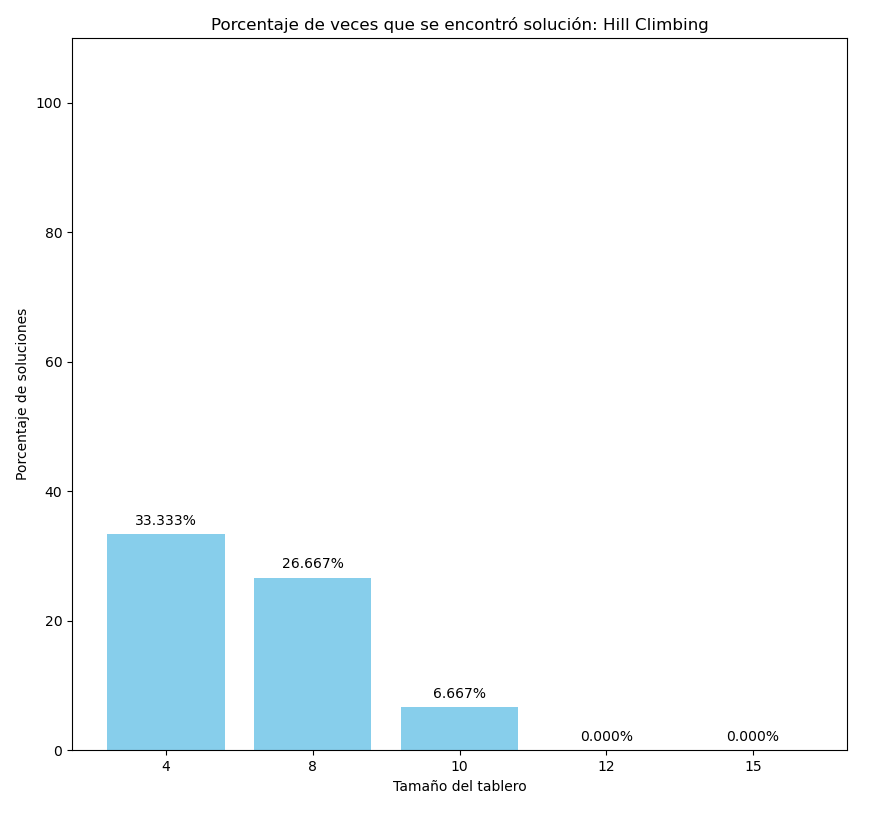
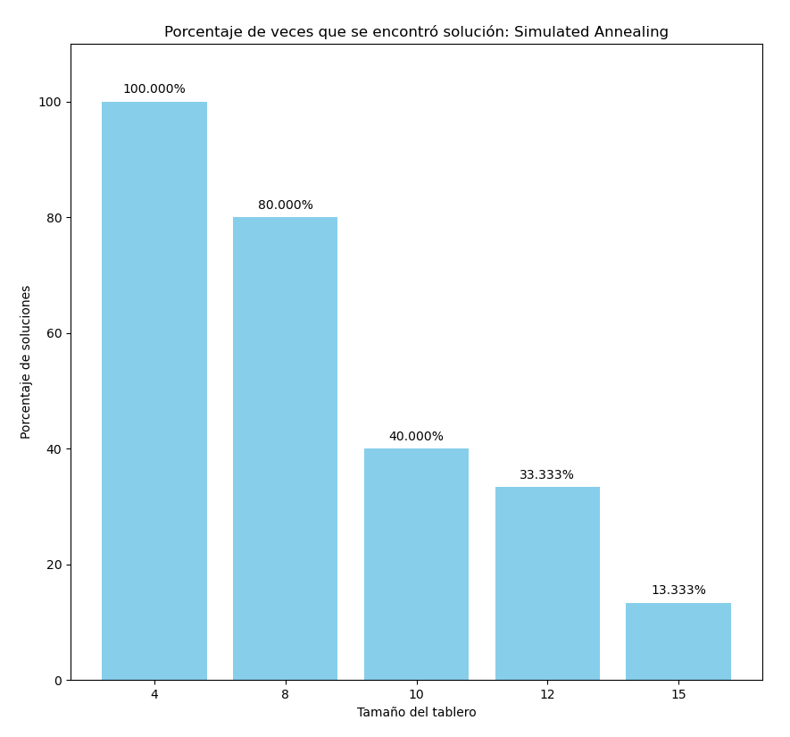

Se puede observar que Hill Climbing presenta una baja probabilidad de encontrar la solucion óptima y esta probabilidad decae a medida que incrementa el tamaño del entorno a resolver, a diferencia del Algoritmo Genetico y Simulated Annealeng, los cuales alcanzan el estado optimo en entornos pequeños, y si bien su porcentaje de soluciones exitosas disminuye al aumentar el tamaño del entorno, la probabilidad de hallar una solucion optima es significativamente mejor que Hill Climbing. Esto es debido a la posibilidad de explorar nuevas soluciones, aceptando valores heuristicos peores en el caso de Simulated Annealing e introduciendo mutaciones en el caso del Algoritmo Genetico, estas posibilidades de variacion nos ayudan a no quedarnos estancados en óptimos locales. 

